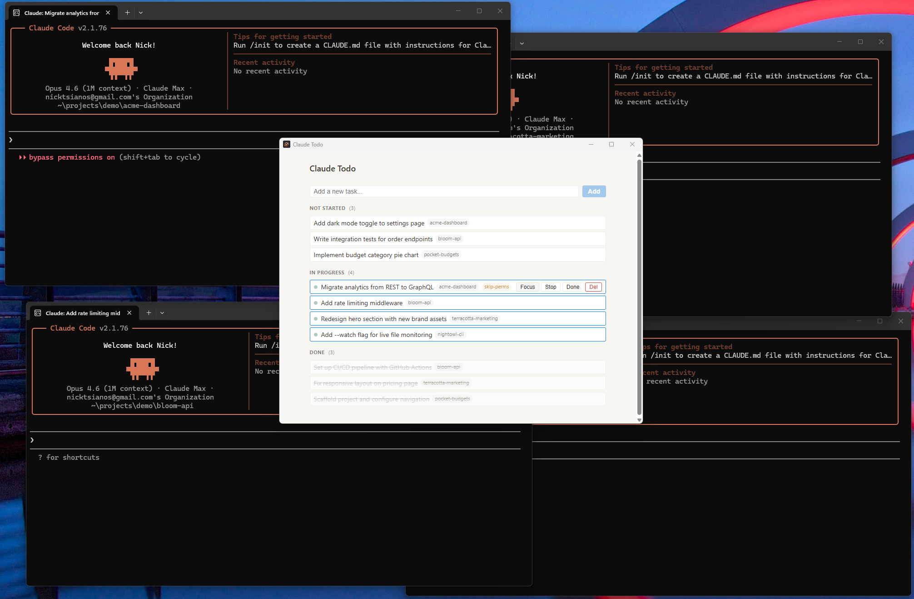

# Claude Todo

A lightweight desktop app for managing [Claude Code](https://docs.anthropic.com/en/docs/claude-code) terminal sessions. Think of it as a simple todo list that can launch, focus, pause, and close Claude Code terminals on your behalf.

<!--  -->

## Why

If you work with Claude Code across multiple projects or tasks, you've probably ended up with a mess of terminal tabs, each running a different session, with no easy way to see what's active, resume something you paused, or keep track of what's done.

You could self-manage tabs, try different terminal multiplexers, or reach for a full project management tool -- but those are either too low-level or too heavy for the problem. What's missing is a thin management layer between your todo list and your terminals.

Claude Todo fills that gap. Your tasks are stored as a plain markdown file. The app reads it, lets you manage tasks through a clean UI, and handles the terminal lifecycle for each one. No accounts, no sync, no complexity -- just a `.md` file and a native window.

## Features

- **Task management** -- Create, edit, reorder, and delete tasks across Not Started / In Progress / Done columns
- **Terminal lifecycle** -- Start a Claude Code session for any task, focus its window, pause it, or mark it done (which closes the terminal)
- **Running session detection** -- See which tasks have an active terminal with a live status indicator
- **Session resume** -- Resume a previous Claude Code session by its session ID
- **Per-task configuration** -- Set a working directory, CLI flags (e.g. `--dangerously-skip-permissions`), and extra arguments per task
- **Plain markdown storage** -- All data lives in a single `todos.md` file in your app data directory, human-readable and version-controllable
- **File watcher** -- External edits to `todos.md` are picked up automatically
- **Cross-platform** -- Windows (Windows Terminal) and macOS (iTerm2 / Terminal.app)

## Install

Download the latest installer from the [Releases](https://github.com/thenickot2/claude-todo/releases) page:

| Platform | Download |
|----------|----------|
| Windows  | `.msi` installer |
| macOS    | `.dmg` disk image |

## Build from Source

### Prerequisites

- [Node.js](https://nodejs.org/) (v18+)
- [Rust](https://rustup.rs/) (stable toolchain)
- Platform-specific dependencies:
  - **Windows**: MSVC Build Tools (`stable-x86_64-pc-windows-msvc` toolchain)
  - **macOS**: Xcode Command Line Tools

### Setup

```bash
git clone https://github.com/thenickot2/claude-todo.git
cd claude-todo
npm install
```

### Development

```bash
# macOS
npm run tauri dev

# Windows (Git Bash) — MSVC linker must be on PATH
MSVC_BIN="/c/Program Files (x86)/Microsoft Visual Studio/2022/BuildTools/VC/Tools/MSVC/14.44.35207/bin/Hostx64/x64"
PATH="$MSVC_BIN:$PATH" npm run tauri dev
```

> **Note for Windows:** Git Bash ships its own `/usr/bin/link` which shadows the MSVC linker. The `PATH` prefix ensures the correct `link.exe` is found. Adjust the MSVC version path to match your installation.

### Production build

```bash
# macOS
npx tauri build

# Windows (Git Bash)
MSVC_BIN="/c/Program Files (x86)/Microsoft Visual Studio/2022/BuildTools/VC/Tools/MSVC/14.44.35207/bin/Hostx64/x64"
PATH="$MSVC_BIN:$PATH" npx tauri build
```

### Tests

```bash
# Unit tests (TypeScript, no Tauri runtime needed)
npx vitest run

# Type-check
npx tsc --noEmit
```

## How It Works

Tasks are stored in a markdown file at your OS app data directory (`%APPDATA%/com.claude-todo.app/todos.md` on Windows, `~/Library/Application Support/com.claude-todo.app/todos.md` on macOS). The format is straightforward:

```markdown
# Claude Todo

## Not Started
- [ ] Refactor auth module | id:abc-123 | directory:/projects/myapp | created:2025-03-14

## In Progress
- [ ] Fix login bug | id:def-456 | directory:/projects/myapp | session:s1 | started:2025-03-14

## Done
- [x] Set up CI pipeline | id:ghi-789 | completed:2025-03-12
```

When you click **Start** on a task, the app opens a new terminal tab running `claude --name "task title"` with whatever directory, flags, and extra args you configured. The task moves to In Progress and the app polls for its terminal window so it can show a live status dot.

## Tech Stack

- **Frontend**: React, TypeScript, Vite
- **Backend**: Rust, [Tauri 2.0](https://v2.tauri.app/)
- **Window management**: Win32 API (Windows), AppleScript (macOS)
- **Storage**: Plain markdown, no database

## Contributing

Contributions are welcome. Please open an issue first to discuss what you'd like to change.

```bash
# Run tests before submitting a PR
npx vitest run
npx tsc --noEmit
```

## License

[MIT](LICENSE)
